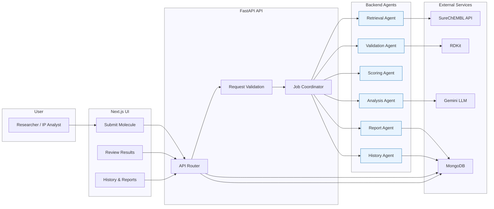

# PatentPilot — AI-Assisted Freedom-to-Operate Analysis

**PatentPilot** is an AI-powered Freedom-to-Operate (FTO) analysis platform that helps pharmaceutical researchers, computational chemists, and IP professionals identify potentially relevant patents from a molecular structure. It combines deterministic risk scoring with grounded LLM explanations to accelerate early-stage patent assessment.

## ✨ Features

- RDKit-based SMILES validation and canonicalization
- SureChEMBL-powered patent retrieval
- Deterministic patent risk scoring
- Gemini-generated evidence-grounded explanations
- Structured FTO report generation
- MongoDB-backed analysis history

## 🏛️ Architecture Overview

PatentPilot is split into a modern React-based frontend, an async FastAPI backend, and specialized backend agents/services for chemistry, patent retrieval, scoring, and AI explanation.



## 🔍 Retrieval Strategy

### Why Two Sources?

PatentPilot currently uses a **SureChEMBL-only retrieval pipeline**:

1. **SureChEMBL** (Chemical → Patent Mapping)
   - Primary discovery source: maps molecular structures to patents that mention them
   - Resolves a query SMILES to SureChEMBL chemical IDs
   - Fetches associated patent documents for those chemical IDs
   - Returns patent IDs + document titles + similarity hints
   - Free, publicly accessible (maintained by EMBL-EBI)

### Why this source?

SureChEMBL gives us the cleanest live chemical-to-patent path for the current build. We still keep nullable metadata fields in the data model so the app can evolve later if richer enrichment is added back.

---

## 🤖 AI Workflow

```
Submit Molecule (SMILES + target + disease)
        │
        ▼
   ┌─────────────┐
   │   Validate   │◄── RDKit: parse & canonicalize SMILES
   │   SMILES     │    Invalid? → Return error immediately
   └──────┬──────┘
          ▼
   ┌─────────────┐
   │  Retrieval   │◄── SureChEMBL: resolve SMILES to chemical IDs
   │   Agent      │◄── SureChEMBL: fetch associated patent documents
   └──────┬──────┘
          ▼
   ┌─────────────┐
   │ Validation   │◄── Are there ≥3 patents?
   │   Agent      │    No → retry with lower threshold (0.7→0.5→0.3)
   └──────┬──────┘     Still no → flag as low-evidence
          ▼
   ┌─────────────┐
   │    Risk      │◄── Deterministic: 0.5·S + 0.2·T + 0.15·D + 0.15·L
   │   Scoring    │    (weights redistributed if target/disease absent)
   └──────┬──────┘
          ▼
   ┌─────────────┐
   │  Analysis    │◄── Gemini: per-patent grounded explanations
   │   Agent      │    Strictly references retrieved data only
   └──────┬──────┘     States "uncertain" on missing fields
          ▼
   ┌─────────────┐
   │   Report     │◄── Assembles: executive summary, key patents,
   │   Agent      │    novelty concerns, manual review list,
   └──────┬──────┘     recommendation with factor attribution
          ▼
   ┌─────────────┐
   │   History    │◄── Persists to MongoDB
   │   Agent      │    Full analysis retrievable without re-querying APIs
   └─────────────┘
```

### Orchestration Decision

The Coordinator is a **plain Python deterministic pipeline** — not LangGraph or a fully dynamic multi-agent framework. This is an intentional design choice:

- **Deterministic outer flow**: The pipeline steps are always the same: validate → retrieve → check evidence → score → analyze → report → save. There's no decision-making about *what* to do next.
- **Agentic inner layer**: Gemini function-calling is scoped inside the Retrieval Agent (deciding query parameters) and Analysis Agent (generating grounded explanations) — the parts where LLM flexibility adds genuine value.
- **Demoability**: A deterministic pipeline is easier to debug, test, and demonstrate than a fully dynamic agent graph.
- **LangGraph migration**: Explicitly planned as future work if orchestration complexity grows (e.g., adding batch processing, conditional multi-source retrieval).

---

## 🛠 Technologies Used

| Layer | Technology | Version | Purpose |
|---|---|---|---|
| Frontend | Next.js | 15.x | React-based UI with App Router |
| Styling | Vanilla CSS | — | Dark theme, glassmorphism, animations |
| Backend | FastAPI | 0.115+ | Async REST API |
| Chemistry | RDKit | 2024.3 | SMILES validation, fingerprinting, Tanimoto similarity |
| Patent Discovery | SureChEMBL API | v3 | Chemical-to-patent mapping |
| AI/LLM | Google Gemini | 2.0 Flash | Per-patent explanations, report generation |
| Database | MongoDB | 7.x | Analysis & report persistence |
| Python MongoDB | Motor | 3.7 | Async MongoDB driver |
| HTTP Client | httpx | 0.28 | Async HTTP for external APIs |

---

## 📊 Risk Scoring Methodology

### Per-Patent Risk Score

Each retrieved patent gets two separate values:

- `similarity_score`: the raw structural similarity returned by retrieval
- `risk_score`: the deterministic, documented formula below

```
risk_score = 0.50 × S + 0.20 × T + 0.15 × D + 0.15 × L
```

| Factor | Weight | Source | Range |
|---|---|---|---|
| **S** — Structural Similarity | 0.50 | SureChEMBL document hit / query match | 0.0 – 1.0 |
| **T** — Target Overlap | 0.20 | Keyword match vs. submitted target | 0.0 – 1.0 |
| **D** — Disease Overlap | 0.15 | Keyword match vs. submitted indication | 0.0 – 1.0 |
| **L** — Legal Status | 0.15 | Nullable / not currently sourced in the live flow | 0.0 – 1.0 |

### Weight Redistribution

When target and/or disease are not submitted, their weights are **redistributed** (not zeroed):

| Scenario | S | T | D | L |
|---|---|---|---|---|
| All provided | 0.500 | 0.200 | 0.150 | 0.150 |
| No target | 0.600 | 0.000 | 0.150 | 0.250 |
| No disease | 0.575 | 0.200 | 0.000 | 0.225 |
| Neither provided | 0.675 | 0.000 | 0.000 | 0.325 |

### Overall Recommendation

Uses the **maximum** patent score (not average) — a single close hit creates real risk:

| Max Score | Recommendation |
|---|---|
| ≥ 0.75 | 🔴 **High Patent Risk** |
| 0.40 – 0.74 | 🟡 **Requires Expert Review** |
| < 0.40 | 🟢 **Low Patent Risk** |

### Safety Rule (FR7)

If fewer than 3 patents are found (even after retry), the recommendation is **forced to "Requires Expert Review"** regardless of score. Absence of matches ≠ absence of risk.

### Confidence Labels (per patent)

| Label | Criteria |
|---|---|
| **High** | Similarity > 0.7 AND (target or disease matched) AND metadata complete |
| **Medium** | Similarity 0.4–0.7 OR partial metadata |
| **Low** | Similarity < 0.4 OR abstract/legal-status missing |

Confidence labels are **computed in code** and passed as inputs to the Gemini prompt — the LLM never invents its own confidence.

---

## ⚖️ Assumptions & Trade-offs

### Assumptions

1. **Weight redistribution** (above): When target/disease fields are empty, their scoring weight is split between structural similarity and legal status rather than being zeroed. This ensures the score remains calibrated on a 0–1 scale.

2. **Low-evidence safety rule**: The system never returns "Low Patent Risk" when evidence is thin (< 3 patents). This errs on the side of caution — the user should know that absence of matches could mean the search was insufficient, not that the molecule is clear.

3. **Metadata sparsity**: The current live flow does not enrich every patent with abstract/legal-status fields, so the UI and report must tolerate missing metadata cleanly.

4. **SureChEMBL as primary source**: SureChEMBL covers patents with chemical annotations but may miss broad genus (Markush) claims that don't explicitly depict a specific structure.

### Trade-offs

| Decision | What we chose | Alternative | Why |
|---|---|---|---|
| **Orchestration** | Deterministic Coordinator | LangGraph dynamic orchestration | Pipeline steps are always the same; dynamic routing adds complexity without value at MVP scale |
| **Retrieval** | Structural similarity only | Embedding-based semantic search on abstracts/claims | Structural search is precise and fast; embedding reranking is future work (P2) |
| **Risk scoring** | Deterministic formula | LLM-assessed risk | Reproducible, auditable, explainable; LLM confidence is not trustworthy for legal-adjacent decisions |
| **Database** | MongoDB (document store) | PostgreSQL (relational) | Document store handles sparse per-patent metadata naturally |
| **AI model** | Gemini 2.0 Flash | GPT-4 / Claude | Fast, cost-effective for per-patent analysis; adequate quality for grounded explanations |

---

## 🚀 Future Improvements

### P1 (Fast Follow)
- **Validation Agent retry hardening** — smarter broadening strategies
- **Report export** — PDF/Markdown downloadable reports
- **Target/disease keyword matching** — entity-level matching beyond simple word overlap
- **Manual review workflow** — analyst can mark patents as reviewed, add notes

### P2 (Roadmap)
- **Semantic/embedding reranking** — vector similarity on abstracts/claims for cases structural search misses
- **Markush/genus claim parsing** — detect broad genus claims that structural search would miss
- **Multi-molecule batch submission** — analyze a chemical series (20+ analogs) in one job
- **LangGraph migration** — replace deterministic Coordinator if tool-selection logic grows complex
- **PubChem cross-referencing** — additional chemical metadata source
- **Team workspaces** — multi-user organizations, shared history, comment threads

---

## 💻 Local Development Setup

### Prerequisites

- **Python** 3.10+ (3.11 recommended)
- **Node.js** 18+ (20 LTS recommended)
- **MongoDB** 7.x (local or Atlas)
- **API Keys**:
  - [Google Gemini](https://aistudio.google.com/) — get API key

### Installation

```bash
# Clone the repository
git clone <repository-url>
cd PatentPilot

# ── Backend ──
cd backend

# Create virtual environment
python -m venv .venv
# Windows:
.venv\Scripts\activate
# macOS/Linux:
# source .venv/bin/activate

# Install dependencies
pip install -r requirements.txt

# Configure environment
cp .env.example .env
# Edit .env with your API keys and MongoDB URI

# ── Frontend ──
cd ../frontend
npm install
```

### Running

```bash
# Terminal 1: Start Backend
cd backend
uvicorn app.main:app --reload --port 8000

# Terminal 2: Start Frontend
cd frontend
npm run dev
```

The app will be available at:
- **Frontend**: http://localhost:3000
- **Backend API**: http://localhost:8000

### Running Tests

```bash
cd backend
python -m pytest tests/ -v
```

## 📁 Project Structure

```
PatentPilot/
├── backend/
│   ├── app/
│   │   ├── main.py              # FastAPI entry point
│   │   ├── config.py            # Environment configuration
│   │   ├── models/
│   │   │   ├── schemas.py       # Pydantic request/response models
│   │   │   └── database.py      # MongoDB async connection
│   │   ├── agents/
│   │   │   ├── coordinator.py   # Pipeline orchestrator
│   │   │   ├── retrieval.py     # Patent discovery & document lookup
│   │   │   ├── validation.py    # Evidence sufficiency + retry
│   │   │   ├── analysis.py      # AI per-patent analysis
│   │   │   ├── scoring.py       # Deterministic risk scoring
│   │   │   ├── report.py        # Report assembly
│   │   │   └── history.py       # MongoDB persistence
│   │   ├── services/
│   │   │   ├── rdkit_service.py # SMILES validation & fingerprinting
│   │   │   ├── surechembl.py    # SureChEMBL API client
│   │   │   └── gemini_service.py# Gemini AI client
│   │   └── routes/
│   │       └── api.py           # REST API endpoints
│   ├── tests/
│   │   ├── test_scoring.py      # Scoring formula tests
│   │   └── test_rdkit.py        # SMILES validation tests
│   ├── requirements.txt
│   └── .env.example
├── frontend/
│   ├── app/
│   │   ├── layout.js            # Root layout + fonts
│   │   ├── page.js              # Landing / submission page
│   │   ├── globals.css          # Design system + styles
│   │   ├── analysis/[id]/page.js # Analysis results
│   │   └── history/page.js      # History page
│   ├── components/
│   │   ├── Navbar.js
│   │   ├── MoleculeForm.js
│   │   ├── PatentCard.js
│   │   ├── PatentTable.js
│   │   ├── ReportView.js
│   │   ├── RiskBadge.js
│   │   ├── ConfidenceBadge.js
│   │   ├── LoadingState.js
│   │   └── HistoryList.js
│   └── lib/
│       └── api.js               # Frontend API client
├── README.md
└── .gitignore
```